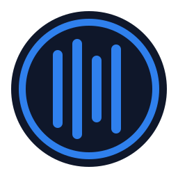

<a id="readme-top"></a>

[![Contributors][contributors-shield]][contributors-url]
[![Forks][forks-shield]][forks-url]
[![Stargazers][stars-shield]][stars-url]
[![Issues][issues-shield]][issues-url]
[![Apache 2.0][license-shield]][license-url]
<!-- [![LinkedIn][linkedin-shield]][linkedin-url] -->

<br/>
<div align="center">
  <a href="https://github.com/BaderLab/ecuda">
    
  </a>

  <h3 align="center">ecuda</h3>
  <!-- <h1 align="center">ecuda</h1> -->

  <p align="center">
    STL-style abstractions for CUDA.
	<br/>
	<a href="https://github.com/BaderLab/ecuda"><strong>Explore the docs »</strong></a>
	<br/>
	<br/>
	<a href="https://github.com/BaderLab/ecuda">View Demo</a>
	&middot;
	<a href="https://github.com/BaderLab/ecuda/issues/new?labels=bug&template=bug-report---.md">Report Bug</a>
	&middot;
	<a href="https://github.com/BaderLab/ecuda/issues/new?labels=enhancement&template=feature-request---.md">Request Feature</a>
  </p>

</div>

<!-- TABLE OF CONTENTS -->

<details>
  <summary>Table of Contents</summary>
  <ol>
    <li>
	  <a href="#about-the-project">About The Project</a>
	</li>
	<li>
	  <a href="#getting-started">Getting Started</a>
	  <ul>
	    <li><a href="#prerequistes">Prerequisites</a></li>
		<li><a href="#installation">Installation</a></li>
	  </ul>
	</li>
	<li>
	  <a href="#usage">Usage</a>
	</li>
	<li><a href="#roadmap">Roadmap</a></li>
	<li><a href="#contributing">Contributing</a></li>
	<li><a href="#license">License</a></li>
	<li><a href="#contact">Contant</a></li>
	<li><a href="#acknowledgements">Acknowledgements</a></li>
  </ol>
</details>

<!-- ABOUT THE PROJECT -->
## About The Project

**ecuda** is a C++ wrapper around the CUDA C API designed to closely resemble and
be functionally equivalent to the C++ Standard Template Library (STL).
Specifically: algorithms, containers, and iterators. These elements play nice
with host containers and can be used in device code.

<p align="right">(<a href="#readme-top">back to top</a>)</p>

### Built With

* [![C++][C++]][C++-url]
* [![CUDA][CUDA]][CUDA-url]

<p align="right">(<a href="#readme-top">back to top</a>)</p>

<!-- GETTING STARTED -->
## Getting Started

### Prerequisites

* CUDA
  ```sh
  sudo apt-get -y install cuda # Debian
  sudo pacman -S cuda # Arch
  ```

### Installation

#### Option 1

1. Clone the repo
```sh
git clone https://github.com/BaderLab/ecuda
```
2. Compile and run the tests (optional)
```sh
cd ecuda
mkdir build
cmake -DECUDA_BUILD_TESTS=ON
make
ctest --output-on-failure
```

#### Option 2

Use FetchContent to add to your own project's `CMakeLists.txt`.

```cmake
# the start of your CMakeLists.txt...

include( FetchContent )

FetchContent_Declare(
    ecuda
    GIT_REPOSITORY https://github.com/BaderLab/ecuda
    GIT_TAG        "master"
    SOURCE_DIR     "${CMAKE_BINARY_DIR}/_deps/ecuda-src"
    BINARY_DIR     "${CMAKE_BINARY_DIR}/_deps/ecuda-build"
)

FetchContent_MakeAvailable( ecuda )

find_package( CUDAToolkit REQUIRED )

# ... the rest of your CMakeLists.txt

target_link_libraries( YourExecutable PUBLIC ecuda::ecuda PRIVATE CUDA::cudart )
```
<p align="right">(<a href="#readme-top">back to top</a>)</p>

## Usage

```cpp
#include <ecuda.hpp>
```

```cpp
template<class Container>
__global__
void
reverse_order(
  typename Container::const_kernel_argument in,
  typename Container::kernel_argument out
)
{
  const int t = threadIdx.x;
  if( t < in.size() ) {
    auto value = *(in.begin()+t);
	*(out.begin()+(out.size()-t-1)) = value;
  }
}
```

```cpp
std::vector<double> hostVector( 1000 );
// ... fill hostVector with data
ecuda::vector<double> deviceVector1( hostVector.begin(), hostVector.end() );
ecuda::vector<double> deviceVector2( 1000 );
CUDA_CALL_KERNEL_AND_WAIT( reverse_order<<<1,1000>>>( deviceVector1, deviceVector2 ) );
ecuda::copy( deviceVector2.begin(), deviceVector2.end(), hostVector.begin() );
```

```cpp
std::vector<double> hostMatrix( 10*10 );
// ... fill hostMatrix with data
ecuda::matrix<double> deviceMatrix1( 10, 10 );
ecuda::matrix<double> deviceMatrix2( 10, 10 );
ecuda::copy( hostMatrix.begin(), hostMatrix.end(), deviceMatrix1.begin() );
CUDA_CALL_KERNEL_AND_WAIT( reverse_order<<<1,10*10>>>( deviceMatrix1, deviceMatrix2 ) );
ecuda::copy( deviceMatrix2.begin(), deviceMatrix2.end(), hostVector.begin() );
```

```cpp
std::vector<double> hostCube( 10*10*10 );
// ... fill hostCube with data
ecuda::cube<double> deviceCube1( 10, 10, 10 );
ecuda::cube<double> deviceCube2( 10, 10, 10 );
ecuda::copy( hostCube.begin(), hostCube.end(), deviceCube1.begin() );
CUDA_CALL_KERNEL_AND_WAIT( reverse_order<<<1,10*10>>>( deviceCube1, deviceCube2 ) );
ecuda::copy( deviceCube2.begin(), deviceCube2.end(), hostVector.begin() );
```

<p align="right">(<a href="#readme-top">back to top</a>)</p>

<!-- ROADMAP -->
## Roadmap

No additional features are planned.

See the [open issues](https://github.com/BaderLab/ecuda/issues) for a full list of proposed features (and known issues).

<p align="right">(<a href="#readme-top">back to top</a>)</p>

<!-- CONTRIBUTING -->
## Contributing

Contributions are what make the open source community such an amazing place to learn, inspire, and create. Any contributions you make are **greatly appreciated**.

If you have a suggestion that would make this better, please fork the repo and create a pull request. You can also simply open an issue with the tag "enhancement".
Don't forget to give the project a star! Thanks again!

1. Fork the Project
2. Create your Feature Branch (`git checkout -b feature/AmazingFeature`)
3. Commit your Changes (`git commit -m 'Add some AmazingFeature'`)
4. Push to the Branch (`git push origin feature/AmazingFeature`)
5. Open a Pull Request

<p align="right">(<a href="#readme-top">back to top</a>)</p>

### Top contributors:

<a href="https://github.com/BaderLab/ecuda/graphs/contributors">
  
</a>

<!-- LICENSE -->
## License

Distributed under the Apache 2.0 license. See `LICENSE.txt` for more information.

<p align="right">(<a href="#readme-top">back to top</a>)</p>

<!-- CONTACT -->
## Contact

Scott D. Zuyderduyn - scott.zuyderduyn@utoronto.ca

Project Link: [https://github.com/BaderLab/ecuda](https://github.com/BaderLab/ecuda)

<!-- ACKNOWLEDGEMENTS -->
## Acknowledgements

* README based on the [othneildrew/Best-README-Template](https://github.com/othneildrew/Best-README-Template)

<p align="right">(<a href="#readme-top">back to top</a>)</p>

<!-- MARKDOWN LINKS & IMAGES -->
<!-- https://www.markdownguide.org/basic-syntax/#reference-style-links -->
[contributors-shield]: https://img.shields.io/github/contributors/BaderLab/ecuda.svg?style=for-the-badge
[contributors-url]: https://github.com/BaderLab/ecuda/graphs/contributors
[forks-shield]: https://img.shields.io/github/forks/BaderLab/ecuda.svg?style=for-the-badge
[forks-url]: https://github.com/BaderLab/ecuda/network/members
[stars-shield]: https://img.shields.io/github/stars/BaderLab/ecuda.svg?style=for-the-badge
[stars-url]: https://github.com/BaderLab/ecuda/stargazers
[issues-shield]: https://img.shields.io/github/issues/BaderLab/ecuda.svg?style=for-the-badge
[issues-url]: https://github.com/BaderLab/ecuda/issues
[license-shield]: https://img.shields.io/github/license/BaderLab/ecuda.svg?style=for-the-badge
[license-url]: https://github.com/BaderLab/ecuda/blob/master/LICENSE.txt
[product-screenshot]: images/screenshot.png
<!-- Shields.io badges. You can a comprehensive list with many more badges at: https://github.com/inttter/md-badges -->
[C++]: https://img.shields.io/badge/C++-%2300599C.svg?logo=c%2B%2B&logoColor=white
[C++-url]: https://isocpp.org/
[CUDA]: https://img.shields.io/badge/CUDA-76B900?logo=nvidia&logoColor=fff
[CUDA-url]: https://developer.nvidia.com/cuda-downloads
